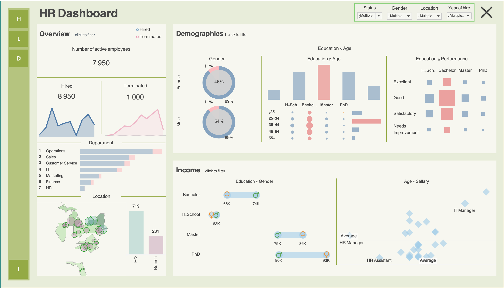

## Human Resources Dashboard (Tableau)

An interactive data visualization project built in Tableau to explore and analyze workforce data. The dashboard provides insights into employee demographics, hiring trends, attrition rates, and organizational structure.

With dynamic filters and intuitive visualizations, users can easily explore patterns and gain actionable insights to support data-driven HR decision-making.

### How to download the file

1. Open the file **Dashboard_tableau.twbx** in this repository  
2. Click the **Download raw file** button (or download icon in the top right corner)  
3. Save the file to your computer
